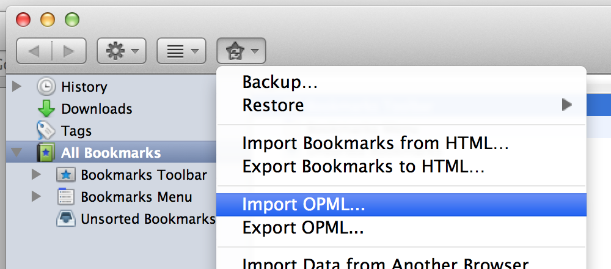

OPML Support is a Firefox extension that adds support for importing and exporting bookmarks in OPML format.

OPML is a file type that is widely used to distribute lists of RSS feeds.

When exporting, you can choose to export your livemarks, bookmarks, or both. When importing a file, you can choose to import only the livemarks, only the bookmarks, or all of the links listed in the file. You can also choose whether to import/export links in their folder hierarchy.

To use, select Export OPML or Import OPML from the Bookmark Manager window's "Import and Backup" menu.

